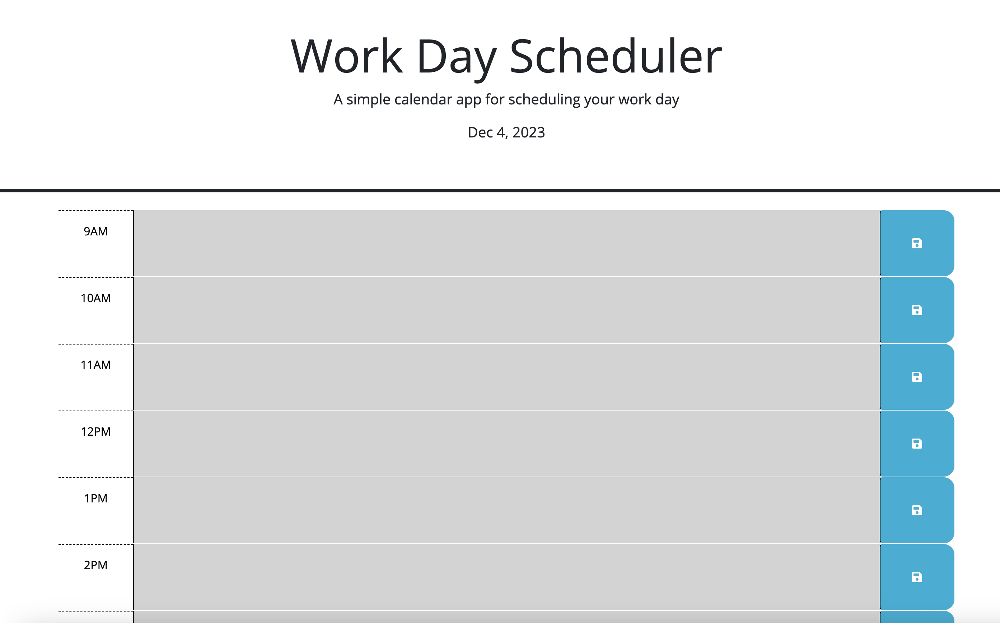

# Work Day Scheduler

# Live URL can be accessed below:

https://yuliyatsoy.github.io/work-day-scheduler/

## What has been done

Created a simple calendar application that allows a user to save events for each hour of a typical working day (9am&ndash;5pm) by modifying starter code. This app will run in the browser and feature dynamically updated HTML and CSS powered by jQuery.
To accomplish that I used the [Day.js](https://day.js.org/en/) library to work with date and time.

## Application functionality:

- when the planner is opened, the current day is displayed at the top
- down below time blocks for standard business hours of 9am&ndash;5pm are presented
- each time block is color coded to indicate whether it is in the past (grey), present (red), or future (green)
- user is able to type in each time block an event
- when user clicks save button, the text for that event is saved in local storage
- if user refreshes the page event persists

## Application appearance is as follows:

